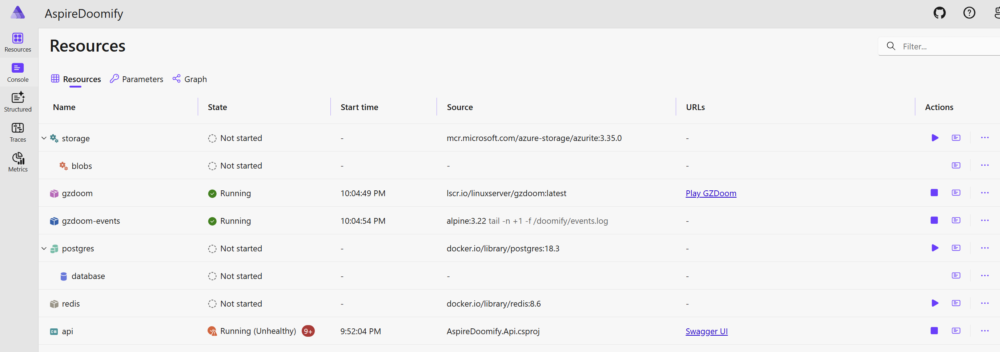

That's my first article - I wanted it to be short and fun. It was always exciting to read about legendary DOOM game being run in [Excel](https://github.com/Pranshul-Thakur/DOOM-in-excel) or on the [pregnancy test](https://www.reddit.com/r/gaming/comments/ncmegl/doom_running_on_a_pregnancy_test/). Since I am not a hardware expert (yet?), I decided to connect DOOM to something I am aware of (and actually even contributed a small feature to) - [Aspire](https://aspire.dev).

Aspire is amazing: it has many definitions for different use-cases, but for me it's a tool to manage all of my dependencies in the inner-loop. Let's consider this example:

```csharp
var builder = DoomedApplication.CreateBuilder(args);

var redis = builder.AddRedis("redis");
var storage = builder.AddAzureStorage("storage");
var postgres = builder.AddPostgres("postgres");

var api = builder.AddProject<Projects.AspireDoomify_Api>("api")
    .WithReference(redis)
    .WithReference(blobs)
    .WithReference(database);
```

This aspire host is trivial - we have a web-api, which has a dependency on redis, azure storage and postgres. Normally you would start your application and dependencies via `aspire run`, and see them green on the dashboard - but they are not running, except a mysterious **gzdoom**.



What I really like about aspire is extensibility in any part of the stack. It's up to you - just building a specific app and defining/managing dependencies or starting "from scratch" by using your own `IDistributedApplicationBuilder`. `DoomedApplicationBuilder` is as simple as overriding `Build` behavior to:

1) call `.WithExplicitStart()` on the resources (that's why they are not running by default)
2) setup the assets/scripts/mods for [GZDoom](https://github.com/zdoom/gzdoom)
3) add the `DoomEventBridge` service which is the connector between game and aspire.

<video src="/videos/demo.mp4" controls playsinline preload="metadata"></video>